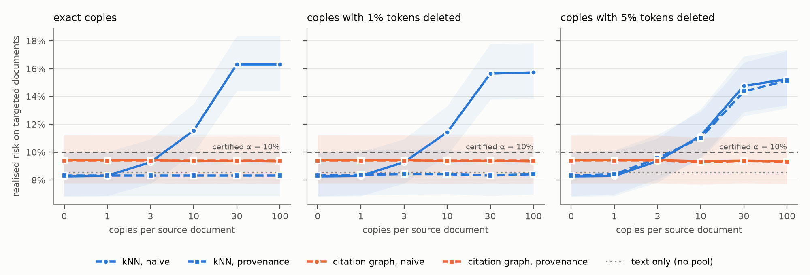

# EviGraph

[](https://github.com/denis-samatov/evigraph/actions/workflows/ci.yml)

A research project on **certified document tagging** with concepts from a controlled
vocabulary: the system applies a tag automatically only if the error rate among automatic
tags is guaranteed (with probability 1 − δ) not to exceed α, and sends everything else to an
expert.

Working paper title: **"Copies Are Not Corroboration: Certified Document Tagging under Source
Duplication"** — draft in [`docs/paper/draft.md`](docs/paper/draft.md).

## Main results

Corpus: MultiEURLEX (English, 127 EuroVoc concepts) plus 274k act-to-act relations from
EUR-Lex. Every experiment was registered in [`docs/PROTOCOL.md`](docs/PROTOCOL.md) before it
was run; the held-out test period was opened once, in protocol 3.0 ([results](research/reports/PROTOCOL_V3_RESULTS.md)).

1. **The citation graph does not improve accuracy beyond retrieval.** LEGAL-BERT + retrieval
   of similar documents automates 56.3% of tags at α = 10%, LEGAL-BERT + graph 55.4%
   ([protocol 1.0 results](research/reports/PROTOCOL_V1_RESULTS.md)).
2. **Retrieval of similar documents breaks the guarantee when copies enter the collection.**
   With 30 copies of a source, the realised risk on affected documents is 16.3% at a certified
   10% (confirmatory run, [protocol 2.1 results](research/reports/PROTOCOL_V21_RESULTS.md);
   first attempt: [2.0](research/reports/PROTOCOL_V2_RESULTS.md)).
3. **Provenance-aware aggregation removes the effect of copies the detector recognises** (by
   construction for exact copies) at no cost on clean data, but not of edited copies that
   MinHash misses; **the citation graph is unaffected** (−0.1 pp), because a copy with a new
   identifier receives no incoming links. An independent critical review of these claims is
   in [`docs/REVIEW_LOG.md`](docs/REVIEW_LOG.md).
4. **Certificates do not transfer in time.** On the held-out period (2012–2016, three seeds),
   policies certified at α = 10% on 2010–2012 acts run at 10.7–12.3% risk; findings 1–3
   replicate there ([protocol 3.0](research/reports/PROTOCOL_V3_RESULTS.md)).
5. **Re-certification on ~1,000 recent labelled documents restores α = 10%**, and word
   containment detects deleted copies at any deletion rate. Moderate token substitution
   (5–30%) evades every detector tested yet still raises risk
   ([protocol 4.0](research/reports/PROTOCOL_V4_RESULTS.md)).
6. **Strong text is the main lever:** at α = 5% automation grows from 4.9% (TF-IDF) to 34.3%
   (LEGAL-BERT + kNN).



## Product: EviGraph Core

[`services/core`](services/core/README.md) turns these results into a service: ingestion with
provenance, suggestions with supporting evidence, expert review with optimistic concurrency,
certified auto-apply per catalog and audit-based monitoring that suspends auto-apply when the
guarantee no longer holds. On MultiEURLEX with 2,000 reviewed documents, it certifies a
threshold at α = 10% and auto-applies tags to later documents with a realised error rate of 6.3%.

```bash
docker compose up --build        # API on http://localhost:8000/docs
```

## Layout

| Path | Contents |
|---|---|
| [`docs/PROTOCOL.md`](docs/PROTOCOL.md) | evaluation protocol: versions 1.0, 2.0, 2.1 and their history |
| [`docs/paper/draft.md`](docs/paper/draft.md) | paper draft |
| [`research/`](research/README.md) | research code, tests, reports |
| [`services/core/`](services/core/README.md) | EviGraph Core service (FastAPI, PostgreSQL) |
| [`apps/studio/`](apps/studio/README.md) | EviGraph Studio IDE (Theia + GLSP) |
| [`docs/IMPLEMENTATION_PLAN.md`](docs/IMPLEMENTATION_PLAN.md) | product milestones and status |
| `research/reports/` | JSON results and a report per protocol version |
| `research/reports/figures/` | paper figures |

## Reproducing

```bash
cd research && make dev && make all
```

Then, in order: `uv run evigraph-research strong-text` (LEGAL-BERT fine-tuning, ~6 h on Apple
MPS), `uv run evigraph-research compare` (protocol 1.0), `uv run evigraph-research h2 --version 2.1`
(protocol 2.1), and `uv run python -m evigraph_research.figures h2_results_v21.json`.

The original product idea — an IDE for reviewing a knowledge graph built from documents
(Theia + GLSP, a Python core) — is described in the initial architecture document; the research
part establishes what such a system can base its quality guarantees on.

## License

Code: Apache License 2.0 ([`LICENSE`](LICENSE)); `apps/studio` is derived from an Eclipse GLSP
template and keeps its EPL-2.0 / GPL-2.0 / MIT terms. Data are not included and keep their own
licenses — notably RusLawOD is CC BY-NC 4.0 (research use only). See [`NOTICE`](NOTICE).
