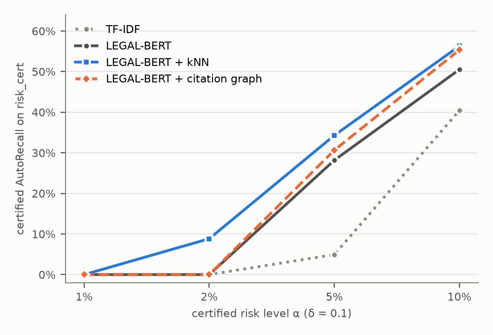

# Copies Are Not Corroboration: Certified Document Tagging under Source Duplication

*Working draft, 2026-10-08. Numbers are generated from `research/reports/*.json`; every
experiment was pre-registered in `docs/PROTOCOL.md` before it was run.*

## Abstract

Automatic document tagging is deployable only when the error rate of the tags it applies
without review is controlled. Learn-then-Test (LTT) certifies a confidence threshold so that
the risk of auto-applied tags stays below a level α with high probability, assuming that the
data seen at deployment are exchangeable with the certification data. We study what happens
when this assumption is broken in a specific and common way: the reference collection that a
tagger retrieves evidence from receives copies of existing documents. On MultiEURLEX (English,
127 EuroVoc concepts) enriched with 274k act-to-act relations from EUR-Lex, in a sequence of
pre-registered experiments, we find that (i) a citation graph adds no accuracy over a strong
text model once a retrieval control with the same label information is included; (ii) the
best system — LEGAL-BERT with k-nearest-neighbour label propagation — loses its certified
guarantee when sources are duplicated after certification: realised risk on affected
documents grows from 8.3% to 16.3% at a certified 10%, and over all certification documents
from 8.7% to 13.8%; (iii) aggregating evidence by provenance group removes the effect of copies
that the detector recognises — by construction for exact copies — at no cost on clean data,
but not of edited copies that MinHash misses; and (iv) identifier-based citation links are
unaffected because copies receive no incoming links. We read this as a measured failure mode
of retrieval-based certified tagging and a mapping of where a simple fix works, not as a new
robustness guarantee. A single pre-registered evaluation on the held-out test period
(2012–2016, three LEGAL-BERT seeds) replicates both findings and adds a third: certificates
computed on 2010–2012 acts do not transfer in time. The realised risk of policies certified at
10% is 10.7–12.3% on later acts, while only the weakest (TF-IDF) system stays within α.

## 1. Introduction

Two families of signals are commonly added to a text classifier for tagging documents with
concepts from a controlled vocabulary: *retrieval* — labels of similar documents in a
reference collection — and *structure* — labels of documents linked by citations,
amendments or a shared legal basis. Both are forms of label propagation, and both are usually
evaluated on accuracy.

We evaluate them instead as components of a *certified* tagging policy: a tag is applied
automatically only if the system's score clears a threshold certified by LTT to keep the
error rate of applied tags below α; everything else goes to a human reviewer. The relevant
quantity is the share of correct tags the policy can apply automatically (AutoRecall) at a
given α, and whether the realised risk stays below α in deployment.

The guarantee holds for exchangeable data. In document collections, a frequent violation is
duplication: templated acts, re-published texts, mirrored or slightly edited copies. A
retrieval-based tagger counts each copy as an independent vote. When copies arrive after
certification, the policy becomes over-confident exactly where copies dominate the
neighbourhood — and nothing in the deployed system signals it.

**Contributions.**

1. A pre-registered evaluation protocol for certified multi-label tagging with a frozen
   five-way split, a sealed final test set and explicit decision rules (§3).
2. A negative result on accuracy: EUR-Lex relations carry strong label signal (neighbour
   vote mRP 0.53 vs 0.17 for the prior), but add nothing over a retrieval control with the
   same label information (§4).
3. A measured failure mode: kNN label propagation breaks certified guarantees under
   post-certification duplication. Provenance-aware aggregation neutralises copies that the
   detector attributes to their source (trivially so for exact copies), and the limit of the
   fix is the copy detector (§5).
4. A methodological note: percentile bootstrap intervals of a *certified* AutoRecall are
   biased downwards because of the fixed-sequence stopping rule (§8).
5. A single held-out evaluation with three seeds that replicates both findings and shows that
   certificates do not transfer across a two-to-six-year gap (§6). Re-certification on about
   1,000 recent labelled documents restores α = 0.10. Word containment closes the deletion
   gap of copy detection. Moderate token substitution remains undetected yet harmful (§7).

## 2. Data

* **MultiEURLEX**, English, EuroVoc level 2 (127 concepts), 65k EU acts with publication
  dates (Chalkidis et al., 2021).
* **EUR-Lex relations**: 274,078 edges from the Cellar SPARQL endpoint (cites, amends,
  repeals, based on, and rarer types); 99.96% of documents have at least one. Properties
  that encode the labels or classifications close to them (EuroVoc, subject matter,
  directory code) are excluded.
* **Duplicates**: MinHash LSH over word 5-grams. Exact copies are rare (28 documents), near
  copies (Jaccard ≥ 0.9) cover 4,813 documents, template copies (digits masked) 14,856 (23%).
  Templates change every few years, so under a chronological split copies almost never cross
  split boundaries (0.04–0.06% of calibration/certification/test documents): natural
  duplication cannot test robustness, which motivates the controlled injection of §5.

**Splits.** Official train is split chronologically into *train* (≤ 2007-10, 49,998 docs)
and *model_dev* (4,900); official dev is split by provenance group into *calib_fit* (2,341)
and *risk_cert* (2,659); official test (5,000) is *final_test* and remains sealed.
Split groups join exact copies, near copies and corrigenda.

**Sanity check against published numbers.** Fine-tuned LEGAL-BERT (T1) reaches mRP 0.735 on
risk_cert and C1 0.754. Chalkidis et al. (2021, Table 8) report mRP 0.736 for XLM-R fine-tuned
end-to-end on English level 2. Their number is on the official test split and ours on a
subset of the official dev split, so this is a plausibility check, not a comparison of models.

## 3. Method and protocol

**Systems.** Every system is the same stacker — logistic regression over (document, concept)
pairs with a prior term — fitted on model_dev (2-fold out-of-fold by split group) over
different feature blocks:

| System | Features |
|---|---|
| T0 | TF-IDF (hashed uni+bigrams) + per-concept SGD logistic regression |
| T1 | LEGAL-BERT base, fine-tuned 4 epochs, first 512 word pieces |
| C1 | T1 + kNN vote: similarity-weighted labels of the 20 nearest train documents |
| C2 | T1 + text model over the document and the text of its graph neighbours (no labels) |
| G1 | T1 + graph votes: mean labels of train neighbours per relation type |
| G2 | T1 + kNN vote + neighbour text + graph votes |

**Certification.** Thresholds on the raw stacker score form a geometric grid fixed on
calib_fit; LTT with fixed-sequence testing and a one-sided Clopper–Pearson bound certifies
the most permissive threshold with risk ≤ α at δ = 0.1 on risk_cert.

**Provenance-aware aggregation.** A provenance group is one source however many members it
has. For kNN, candidates are collapsed to groups (group similarity = max over members, group
labels = mean over members) and the top-k groups vote; the candidate window widens until it
holds k groups (protocol 2.1). For the graph, a document's neighbours are collapsed to groups
and the hub-size cap counts groups. *Property:* exact copies that join their source's group
change neither vote (tested in `tests/test_provenance.py`).

**Protocol discipline.** Protocol 1.0 (H1) was frozen before the strong text model existed;
2.0 (H2) before the duplication experiment; 2.1 after analysing the 2.0 failure, with fresh
targets. Each version is a commit preceding its results.

## 4. H1: does the citation graph add accuracy beyond text?

Certified AutoRecall on risk_cert (δ = 0.1):

| System | α = 0.02 | α = 0.05 | α = 0.10 |
|---|---|---|---|
| T0 TF-IDF | 0 | 4.9% | 40.4% |
| T1 LEGAL-BERT | 0 | 28.2% | 50.5% |
| C1 + kNN | **8.8%** | **34.3%** | **56.3%** |
| C2 + neighbour text | 0 | 26.4% | 50.4% |
| G1 + graph | 0 | 30.6% | 55.4% |
| G2 + kNN + neighbour text + graph | 0 | 24.2% | 54.1% |

The pre-registered rule (graph better than the controls in all three contrasts, lower CI
bound > 0) is not met. G1 − C1 = −0.9 pp with interval [−7.0, −0.5] pp, and G2 − C1 =
−2.2 pp [−6.0, −1.6]: adding the graph makes certified automation *lower* than retrieval
alone. These intervals come from bootstrapping a certified quantity, which is biased
downwards (§8); the point estimates point the same way. On the secondary metric (model_dev
mRP, out-of-fold) G2 is the best system (+1.4 to +2.0 pp over C1), so better ranking does not
translate into more certified automation. The graph helps the strong text model (+4.8 pp over
T1), but the same label information is available from retrieval. A strong text model is the main lever:
moving from TF-IDF to LEGAL-BERT + kNN multiplies certified automation at α = 0.05 by seven.

## 5. H2: certified tagging under source duplication

*Scenario.* Policies are fitted and certified on the clean pool. At deployment, each target
document's nearest train document is copied m ∈ {1, 3, 10, 30, 100} times (exact, or with 1%
/ 5% of tokens deleted); copies inherit the source's labels and outgoing EUR-Lex links but
receive no incoming links. Stackers and thresholds stay fixed.

**Protocol 2.0** (500 targets, 361 sources): naive kNN realised risk on targets rises from
8.2% to 10.9% (m = 10) and 15.9% (m ≥ 30), above the certified 10% (H2a met). Provenance kNN
is exactly invariant up to m = 30 but drifts to 9.8% at m = 100 (H2b not met), because the
fixed candidate window was exhausted by copies of nearby sources. Clean cost is nil (H2c
met). Citation-graph votes move by at most 0.4 pp in every scenario.

**Protocol 2.1** (500 fresh targets disjoint from 2.0, adaptive window; confirmatory).
All four rules hold:

| Rule (m = 100 exact copies, α = 0.10) | Result |
|---|---|
| H2a naive kNN realised risk on targets | 8.3% → **16.3%** (95% CI 14.4–18.4%) |
| H2b provenance kNN risk change | **0.0 pp** (95% CI 0.0–0.0) |
| H2c clean AutoRecall, provenance − naive | +0.02 pp |
| H2d citation-graph risk change | −0.1 pp (95% CI −0.4 to +0.3) |

Naive kNN exceeds the certified level from m = 10 (11.6%). At m ≥ 20 copies fill all k = 20
neighbour slots and naive kNN degenerates to 1-NN, which is why m = 30 and m = 100 coincide.

*How to read these numbers.* (a) Targets are selected to be affected, while LTT bounds the
marginal risk. With 19% of certification documents targeted, the marginal risk of naive kNN
over all of risk_cert also exceeds α (8.7% → 13.8%). (b) Targets are risk_cert documents, so
their clean risk is the certification-set risk; only the paired change is informative.
Protocol 3.0 repeats the scenario on `final_test` targets. (c) H2b and H2d hold by
construction for exact copies: identical vectors do not change a group's max similarity or
its mean labels, and copies get no incoming links. Their confirmation shows that the
implementation does what it should; it is not evidence about real data. With 1% of tokens deleted,
provenance kNN stays within 0.1 pp of its clean risk at every m; with 5%, it degrades with
naive kNN (copies are not detected), while the graph does not move.

**Limits of detection.** With 5% of tokens deleted, the MinHash Jaccard to the source drops
to 0.66 and only 2.9% of copies are attributed to their source; provenance kNN then behaves
like naive kNN. Citation links stay robust because they do not depend on detecting copies.

**Mislabelled copies** (copies carry another document's labels, m = 100, protocol 2.1):
naive kNN risk on targets rises to 15.7% while its AutoRecall falls from 56% to 24%;
provenance kNN keeps the risk at 7.6% with AutoRecall 52%; the graph is unaffected.

**Can a covariate-shift correction replace provenance?** (exploratory, not pre-registered;
`research/reports/WEIGHTED_CONFORMAL.md`). We re-certify C1 under the 2.1 scenario with
density-ratio weights in the style of Tibshirani et al. (2019). A gradient-boosting classifier
separates certification-time from deployment-time documents using vote and score descriptors.
Its odds weight the labelled certification set, clipped at 20, and the threshold is
re-certified with Kish's effective sample size. No new labels are used.

| Copies | Detector AUC | Clean τ | Weighted re-cert. | Oracle re-cert. (new labels) | Provenance kNN |
|---|---|---|---|---|---|
| 10 | 0.89 | 11.6% | 9.1% | 9.1% | 8.3% |
| 30 | 0.91 | 16.3% | 12.3% | 10.3% | 8.3% |

Weighting detects the shift and repairs moderate duplication, but not heavy duplication.
Copies change P(y | x): a concentrated vote produced by copies looks like consensus yet is
right less often. That violates the assumption under which reweighting is valid. Even
labelled re-certification controls the average risk, not the risk of the affected subgroup.
A first, weaker detector found no shift at all. Provenance-aware aggregation needs neither
labels nor a detector. Caveats: one scenario and one seed; Kish's effective sample size is a
heuristic, not a finite-sample weighted guarantee; the descriptors were designed knowing how
copies act, which favours the weighted method.

**Transfer to another language and catalog** (exploratory; service benchmark,
`services/core/reports/RUSLAWOD_BENCHMARK.md`). The same certification path runs in the
EviGraph Core service on RusLawOD (Saveliev & Kuchakov, 2024): 8,551 Russian federal acts
with the official 21-section classifier, a TF-IDF engine, and the 1,000 newest acts held out
as a later period. α = 10% certifies from about 500 reviewed acts and α = 5% from about 1,000.
In every certified configuration, across both catalog levels (21 sections and 132 rubrics),
the realised risk on the later acts stayed below α (1.4–7.2%).

## 6. Final evaluation on the held-out period (protocol 3.0)

`final_test` (5,000 acts, 2012-08 to 2016-01) was opened once, after the runner was frozen and
dry-run on risk_cert (`research/reports/PROTOCOL_V3_RESULTS.md`). Three LEGAL-BERT seeds.

**F1, the certificate under temporal drift.** At α = 0.10 the realised risk on `final_test`
is 10.7–12.3% for T1, C1, C1p, G1 and G1p, with the lower interval bound above α in 13 of 15
system × seed cases. Ranking quality drops (mRP 0.75 → 0.70) and certified automation shrinks
(C1: 56% → 48%). TF-IDF stays at 9.8%. At α = 0.05, T1, C1 and C1p stay below α in every seed
(3.2–4.7%), while C2 and G2 do not (5.5–6.8%). A certificate holds for the period it was
computed on; deployment needs labelled audits and re-certification.

**F2, H1 replicated.** G1 − C1 is negative in every seed (−1.2 to −6.5 pp, all intervals
below zero); the graph beats only the neighbour-text control.

**F3, H2 replicated out of sample.** On 500 `final_test` targets, 100 exact copies raise
naive kNN's targeted risk from 12.2% to 20.5% (17.3–24.0%; seeds agree within 0.2 pp). They
leave provenance kNN unchanged and move the graph by +0.2 pp. With 1% of tokens deleted,
MinHash attributes 98.8% of copies and provenance kNN stays at its clean risk. With 5%, it
attributes 2.5% and provenance kNN rises to 19.6%, like naive kNN. All four rules hold in
three of three seeds.

## 7. Closing the gaps: copy detection and re-certification (protocol 4.0)

A further pre-registered protocol tested two follow-ups (`PROTOCOL_V4_RESULTS.md`). The
`final_test` labels were reused and the paper says so.

**H3, copy detection under edits.** We compare three ways to attribute a copy to its candidate
source, the nearest train document. All thresholds were set from genuine risk_cert
documents only. The methods are MinHash Jaccard of 5-grams (≥ 0.8), TF-IDF cosine (≥ 0.92) and
word containment (≥ 0.98), the share of the copy's word types found in the candidate (Broder,
1997). Containment attributes deleted copies at every deletion rate up to 50% (≥ 99%) and keeps
provenance kNN within +0.4 pp of its clean risk in three of three seeds. MinHash and cosine fail
from 5% and 10% deletion respectively. Substituting 5–30% of tokens defeats all three methods
(≤ 11% attribution), yet such copies still raise naive kNN's targeted risk by +1 to +5 pp.
Only around 50% substitution do copies stop mattering. This danger zone is the remaining open
problem.

**H4, re-certification from a recent audit.** `final_test` was split at 2014-01-01. The
threshold was re-certified on 20 random audit samples of N acts from the earlier part and
applied to the later part. At α = 0.10, C1's realised risk falls from 12.0–12.1% (original
certificate) to 8.6–8.9% at N = 1,000. At most 5% of draws exceed α in every seed (rule met
3/3), and AutoRecall falls from about 46% to about 36%. At α = 0.05 a one-off audit is not
enough: the residual drift between audit and evaluation periods consumes the margin (C1 at
4.8–5.5%, 15–95% of draws above α).

## 8. Methodological note: bootstrapping a certified quantity

Percentile bootstrap intervals for certified AutoRecall are skewed: point estimates sit near
the upper end (e.g. 55.4% with interval 48.9–56.3%). Under resampling, any spurious failure
on the threshold path stops the fixed sequence early, so resampled AutoRecall is biased down.
Protocol 2.x therefore evaluates realised risk at a fixed certified threshold.

## 9. Related work

*Distribution-free risk control.* LTT (Angelopoulos et al., 2025) and conformal risk control
(Angelopoulos et al., 2024) certify thresholds under exchangeability; selective
classification (Geifman & El-Yaniv, 2017) is the accuracy–coverage view of the same policy.
Weighted conformal prediction (Tibshirani et al., 2019) and non-exchangeable conformal
prediction (Barber et al., 2023) relax exchangeability under covariate shift or bounded
drift. Duplication of retrieval sources is a shift in P(y | x) for the retrieval features, so
these corrections do not apply directly (§5).

*Duplication.* MinHash resemblance (Broder, 1997) is the standard near-duplicate detector.
Deduplication improves language models and reduces train–test overlap (Lee et al., 2022). We
study duplication in the *retrieval pool* after certification, not in training data.

*Retrieval corruption.* Injecting a few crafted texts into a retrieval corpus can steer
retrieval-augmented generation (Zou et al., 2025). Our setting is benign: copies carry their
source's own labels. Even so, duplication alone breaks certified guarantees.

*Copy detection and robust aggregation.* That copies are not independent evidence is an
established principle. Truth discovery models source dependence so that copied false values
do not win a vote (Dong et al., 2009). kNN's majority vote gives certified robustness to a
bounded number of inserted training points (Jia et al., 2022). RobustRAG isolates passages and
aggregates them securely against retrieval corruption (Xiang et al., 2024). Diversity
re-ranking reduces redundant retrieval results (Carbonell & Goldstein, 1998). Our provenance
aggregation is a simple instance of this family; the contribution is to measure how
duplication interacts with a certified threshold. Related risk-control tools that we do not
use yet are RCPS (Bates et al., 2021) and adaptive conformal inference under drift (Gibbs &
Candès, 2021).

*Legal classification.* MultiEURLEX (Chalkidis et al., 2021), LexGLUE (Chalkidis et al., 2022)
and LEGAL-BERT (Chalkidis et al., 2020) are the benchmark and model base. Calibration of
neural scores (Guo et al., 2017) motivates certifying on raw scores rather than on
recalibrated ones. Provenance groups follow the W3C PROV-O notion of derivation (Lebo et al.,
2013). Evidence faithfulness for the product follows ERASER (DeYoung et al., 2020).

## 10. Limitations

* **Pair dependence.** Clopper–Pearson treats (document, concept) pairs as independent; they
  are nested in documents and in template families. For the certified C1 threshold
  (8,119 applied pairs, empirical risk 8.65%) the bound stays below α = 0.10 even if the
  effective sample size is five times smaller (UCB 0.091 → 0.096). However, a document-level
  bound (e.g. a betting or Hoeffding–Bentkus bound on a per-document loss) would be valid
  without this assumption.
* **Selection on risk_cert.** C1 was chosen as the best of six systems on risk_cert, and the
  primary α = 0.10 was chosen from exploratory version-0 results on the same split. A
  guarantee for the selected system would need a union bound over systems.
* **The duplication is injected and targeted.** Natural cross-split copying is 0.04–0.06%.
  The scenario copies each target's nearest neighbour, the worst case for kNN. A realistic
  duplication process (template families, consolidated versions, paraphrases) and a curve of
  detection rate vs. edit level was measured in §7 with synthetic deletions and random
  substitutions; real paraphrases may behave differently.
* **Missing baselines:** index-time deduplication, diversity re-ranking and per-cluster vote
  caps. Re-certification from a labelled audit is evaluated in §7, but only as a one-off
  audit, not a rolling one.
* **Transductive preprocessing.** Duplicate detection, split groups and hub sizes use the texts
  and links of all documents, `final_test` included (not their labels). The rule that graph
  neighbours are published before the document is enforced for the neighbour-text control
  but not for graph votes; under the chronological split this has no effect.
* One corpus; three LEGAL-BERT seeds share one test set; LEGAL-BERT was pre-trained on EUR-Lex
  text (no labels).

## 11. Reproducibility

`make all` rebuilds data, splits and baselines; `evigraph-research strong-text`,
`compare`, `h2 --version 2.0|2.1` and `python -m evigraph_research.figures` reproduce every
number and figure. Protocol versions, results and code are separate commits in order.

## References

* Angelopoulos, A. N., Bates, S., Candès, E. J., Jordan, M. I., & Lei, L. (2025). Learn then
  Test: Calibrating predictive algorithms to achieve risk control. *Annals of Applied
  Statistics*, 19(2), 1641–1662. doi:10.1214/24-AOAS1998. arXiv:2110.01052.
* Angelopoulos, A. N., Bates, S., Fisch, A., Lei, L., & Schuster, T. (2024). Conformal risk
  control. *ICLR 2024*. arXiv:2208.02814.
* Barber, R. F., Candès, E. J., Ramdas, A., & Tibshirani, R. J. (2023). Conformal prediction
  beyond exchangeability. *Annals of Statistics*, 51(2), 816–845. doi:10.1214/23-AOS2276.
* Bates, S., Angelopoulos, A., Lei, L., Malik, J., & Jordan, M. I. (2021). Distribution-free,
  risk-controlling prediction sets. *Journal of the ACM*, 68(6), 43:1–43:34.
* Broder, A. Z. (1997). On the resemblance and containment of documents. *Compression and
  Complexity of Sequences (SEQUENCES '97)*, 21–29.
* Carbonell, J., & Goldstein, J. (1998). The use of MMR, diversity-based reranking for
  reordering documents and producing summaries. *SIGIR '98*, 335–336.
* Chalkidis, I., Fergadiotis, M., & Androutsopoulos, I. (2021). MultiEURLEX — A multi-lingual
  and multi-label legal document classification dataset for zero-shot cross-lingual transfer.
  *EMNLP 2021*, 6974–6996. arXiv:2109.00904.
* Chalkidis, I., Fergadiotis, M., Malakasiotis, P., Aletras, N., & Androutsopoulos, I. (2020).
  LEGAL-BERT: The Muppets straight out of Law School. *Findings of EMNLP 2020*, 2898–2904.
* Chalkidis, I., Jana, A., Hartung, D., Bommarito, M., Androutsopoulos, I., Katz, D. M., &
  Aletras, N. (2022). LexGLUE: A benchmark dataset for legal language understanding in
  English. *ACL 2022*, 4310–4330.
* Clopper, C. J., & Pearson, E. S. (1934). The use of confidence or fiducial limits illustrated
  in the case of the binomial. *Biometrika*, 26(4), 404–413.
* DeYoung, J., Jain, S., Rajani, N. F., Lehman, E., Xiong, C., Socher, R., & Wallace, B. C.
  (2020). ERASER: A benchmark to evaluate rationalized NLP models. *ACL 2020*, 4443–4458.
* Dong, X. L., Berti-Equille, L., & Srivastava, D. (2009). Integrating conflicting data: the
  role of source dependence. *PVLDB*, 2(1), 550–561.
* Geifman, Y., & El-Yaniv, R. (2017). Selective classification for deep neural networks.
  *NeurIPS 2017*, 4878–4887.
* Gibbs, I., & Candès, E. (2021). Adaptive conformal inference under distribution shift.
  *NeurIPS 2021*. arXiv:2106.00170.
* Guo, C., Pleiss, G., Sun, Y., & Weinberger, K. Q. (2017). On calibration of modern neural
  networks. *ICML 2017*, PMLR 70, 1321–1330.
* Jia, J., Liu, Y., Cao, X., & Gong, N. Z. (2022). Certified robustness of nearest neighbors
  against data poisoning and backdoor attacks. *AAAI 2022*, 36(9), 9575–9583.
* Lebo, T., Sahoo, S., & McGuinness, D. (Eds.) (2013). PROV-O: The PROV Ontology. W3C
  Recommendation, 30 April 2013.
* Lee, K., Ippolito, D., Nystrom, A., Zhang, C., Eck, D., Callison-Burch, C., & Carlini, N.
  (2022). Deduplicating training data makes language models better. *ACL 2022*, 8424–8445.
* Saveliev, D., & Kuchakov, R. (2024). The Russian Legislative Corpus. arXiv:2406.04855.
* Tibshirani, R. J., Barber, R. F., Candès, E. J., & Ramdas, A. (2019). Conformal prediction
  under covariate shift. *NeurIPS 2019*, 2530–2540.
* Xiang, C., Wu, T., Zhong, Z., Wagner, D., Chen, D., & Mittal, P. (2024). Certifiably robust
  RAG against retrieval corruption. arXiv:2405.15556.
* Zou, W., Geng, R., Wang, B., & Jia, J. (2025). PoisonedRAG: Knowledge corruption attacks to
  retrieval-augmented generation of large language models. *USENIX Security 2025*.

Bibliographic details were checked against the publishers' pages (ACL Anthology, PMLR,
NeurIPS proceedings, project Euclid, W3C, arXiv) on 2026-10-08. The page ranges for Broder
(1997) and Geifman & El-Yaniv (2017) come from secondary indexes.
